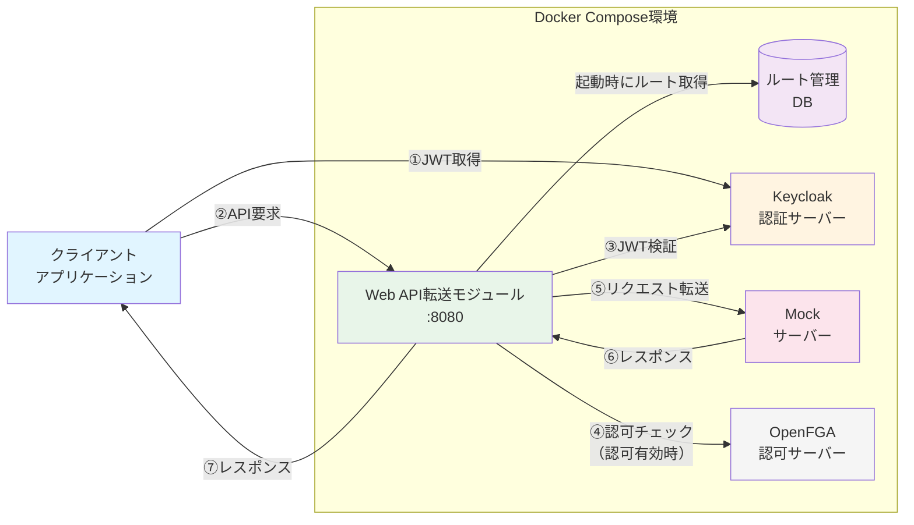

# 参考実装チュートリアル
ODS L2 Web API転送モジュールの参考実装・動作確認例を示す。

## システム構成


## Keycloak設定
1. [http://localhost:8081](http://localhost:8081)にアクセス
2. keycloakの画面が表示される。以下のように入力してSign Inをクリック

```
Username:admin
Password:admin
```


<br>
<br>

3. clientを設定<br>
クライアントのIDを設定
- 例）クライアントID：test_client

<br>
<br>

フローに従って設定を適用する。
- Standard flow：認可コードフローAPI系利用時はこれを☑
- Direct access grants：リソースオーナパスワードクレデンシャルフローAPI系利用はこれを☑
- Service accounts roles：クライアントシステム認証API利用時はこれを☑<br>
※他フローは任意<br>
※任意のrealmやuserを作成したい場合はここで作成

<br>
<br>

4. client secretをコピー
- 3で作成したclientのCredentialsタブからclient secretをコピーしておく


<br>

## Web API転送モジュールの疎通手順
### ■認可が不要な場合（OpenFGAによる認可）
1. ルート登録・確認

```
# 登録
curl -X POST\
    -H "Content-Type: application/json"\
    -H "X-API-KEY: your-secret-management-api-key"\
    -d '{
    "id": "route1",
    "uri": "http://prism:4010",
    "predicates": [{
        "name": "Path",
        "args": {
        "_genkey_0": "/test**"
        }
    }]
    }'\
    http://localhost:8090/actuator/gateway/routes/route1

 # 確認
curl -s -H "X-API-KEY: your-secret-management-api-key"\
    http://localhost:8090/actuator/gateway/routes
```

<br>

2. トークンの取得(clientID:test_client)

```
curl -X POST http://keycloak:8081/realms/master/protocol/openid-connect/token \
  -H "Content-Type: application/x-www-form-urlencoded" \
  -H "accept: application/json" \
  -H "Accept-Language: ja-JP" \
  -d "grant_type=client_credentials" \
  -d "client_id=test_client" \
  -d "client_secret=<コピーしたclient secret>" 
```

<br>

3. Web API転送モジュールへリクエスト送信

```
curl -v -X POST http://localhost:8090/test \
  -H "Content-Type: application/json" \
  -H "Authorization: bearer <取得したトークン>" \
  -H "api-key: 12345-test-key" \
  -d '{"userid":112233}'
```
※クライアントクレデンシャルフローでの認証<br>


4. レスポンス（/testエンドポイント）

```
Request successfully delivered!
```

### ■認可が必要な場合（OpenFGAによる認可）
1. 認可設定手順

1.1 keycloak画面にてアクセストークン **固定値のカスタムクレーム** を設定する。<br>
上記**Keycloak設定**後、Clients一覧へ移動し作成した【test_client】をクリック

<br>
<br>

1.2 client Scopesタブを選択し、【test_client-dedicated】リンクをクリック


<br>
<br>

1.3 【Configure a new mapper】をクリック


<br>
<br>

1.4 【Hardcoded claim】をクリック<br>


<br>
<br>

1.5 以下、設定画面にて各項目を入力<br>
入力が完了したら【SAVE】ボタンクリック
- 例）Name：operator_id
- 例）Token Claim Name：operator_id
- 例）Claim value：sample-user<br>


<br>
<br>

1.6 OpenFGAのプレイグラウンドにアクセスし、ストアを作成<br>
[http://localhost:3000/playground](http://localhost:3000/playground)にアクセスし、以下の内容でストアを作成<br>

- 例）test-store2<br>


1.7 model 作成<br>
モデルの内容を以下の内容に置き換え、【SAVE】ボタンクリック

```txt
model
  schema 1.1

type user

type group
  relations
    define member: [user]

type endpoint
  relations
    define can_access: [user, group#member]
```

<br>
<br>
1.8 Tupleの追加<br>
【ADD TUPLE】をクリック<br>

<br>
<br>
1.9 Tuple の各項目に以下の値を入力し、［SAVE］ボタンを押下。<br>
保存に成功すると「Success! Tuple created!」と表示されます。<br>
- 例）User：user:sample-user
- 例）Relation：can_access
- 例）Object：endpoint:api.test<br>

<br>
<br>

1.10 作成したStoreのStore IDをコピーする


1.11 Web API転送モジュール（L2）を起動させている場合は停止させる。<br>
※Store IDを書き換える上でWeb API転送モジュール（L2）の再起動が必要となります。

```txt
docker compose down gateway
```

1.12 docker-compose.ymlに記載されているenvironmentを以下に変更する。
- FGA_STORE_ID = 上記**1.10 でコピーしたStore ID**
- AUTHZEN_AUTHORIZATION_ENABLED = true

```txt
# docker-compose.ymlを編集モードで開く
vi docker-compose.yml

# 修正箇所
  gateway:
    image: l2-test:latest
    environment:
      - KEYCLOAK_URL=http://keycloak:8081
      - KEYCLOAK_REALM=master
      - FGA_URL=http://openfga:8080
      - FGA_STORE_ID=test-store ← 手順1.10でコピーしたStore IDに変更
      - DB_URL=jdbc:postgresql://postgres:5432/postgres
      - DB_USERNAME=postgres
      - DB_PASSWORD=password
      - DB_SCHEMA=public
      - VALID_API_KEYS=12345-test-key
      - LOGLEVEL=DEBUG
      - VALID_API_KEYS_ENABLED=true
      - AUTHZEN_AUTHORIZATION_ENABLED=false ← OpenFGAによる認可を使用する場合は【true】に変更
```

1.13 Web API転送モジュール（gateway）を再起動

```txt
docker compose up -d gateway
```
 
2. ルート登録・確認

```
# 登録(metadataブロックを追加)
curl -X POST \
  -H "Content-Type: application/json" \
  -H "X-API-KEY: your-secret-management-api-key" \
  -d '{
    "id": "route02",
    "uri": "http://prism:4010",
    "predicates": [{ 
        "name": "Path",   
        "args": { 
        "_genkey_0": "/authtest/**"
         }
    },
      { 
        "name": "Method",
        "args": { 
        "_genkey_0": "POST"
        }
    }],
    "metadata": {
      "endpointId": "api.test"
    }
  }' \
  http://localhost:8090/actuator/gateway/routes/route02

 # 認可エラーのルート登録
curl -X POST \
  -H "Content-Type: application/json" \
  -H "X-API-KEY: your-secret-management-api-key" \
  -d '{
    "id": "route03",
    "uri": "http://prism:4010",
    "predicates": [{ 
        "name": "Path",   
        "args": { 
        "_genkey_0": "/authngtest/**"
         }
    },
      { 
        "name": "Method",
        "args": { 
        "_genkey_0": "POST"
        }
    }],
    "metadata": {
      "endpointId": "api.ng.test"
    }
  }' \
  http://localhost:8090/actuator/gateway/routes/route03
  
 # 確認
curl -s -H "X-API-KEY: your-secret-management-api-key"\
     http://localhost:8090/actuator/gateway/routes | jq
```

3. トークンの取得(clientID:test_client)

```
curl -X POST http://keycloak:8081/realms/master/protocol/openid-connect/token \
  -H "Content-Type: application/x-www-form-urlencoded" \
  -H "accept: application/json" \
  -H "Accept-Language: ja-JP" \
  -d "grant_type=client_credentials" \
  -d "client_id=test_client" \
  -d "client_secret=<コピーしたclient secret>" 
```
※クライアントクレデンシャルフローでの認証<br>


4. Web API転送モジュールへリクエスト送信

```
 # 正常
curl -v -X POST http://localhost:8090/authtest \
  -H "Content-Type: application/json" \
  -H "Authorization: bearer <取得したトークン>" \
  -H "api-key: 12345-test-key" \
  -d '{"userid":112233}'
  
 # 認可エラー
curl -v -X POST http://localhost:8090/authngtest \
  -H "Content-Type: application/json" \
  -H "Authorization: bearer <取得したトークン>" \
  -H "api-key: 12345-test-key" \
  -d '{"userid":112233}'
```

5. レスポンス

```
# 正常（/authtestエンドポイント）
Request successfully delivered!

# 認可エラー（/authngtestエンドポイント）
  {
    "code": "[auth] Forbidden",
    "message": "Access denied",
    "detail": "timeStamp: 2025-09-25T14:30:00Z" // ※この値は実行時の日時に応じて変化します
  }
```

## ドキュメント
- チュートリアルで実行した各コマンドの解説については[こちら](./command.md)を参照
- Web API転送モジュールの仕様は[こちら](./WebAPI転送モジュール（APIゲートウェイ）仕様書.md)を参照