# Reference Implementation Tutorial
This document shows a reference implementation and operational verification examples for the ODS L2 Web API forwarding module.

## System Configuration
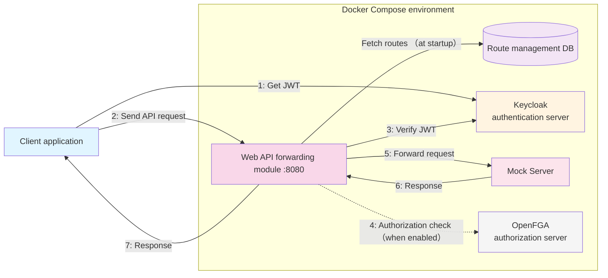

## Keycloak Settings
1. Access [http://localhost:8081](http://localhost:8081)
2. The Keycloak screen appears. Enter the following and click Sign In

```
Username:admin
Password:admin
```

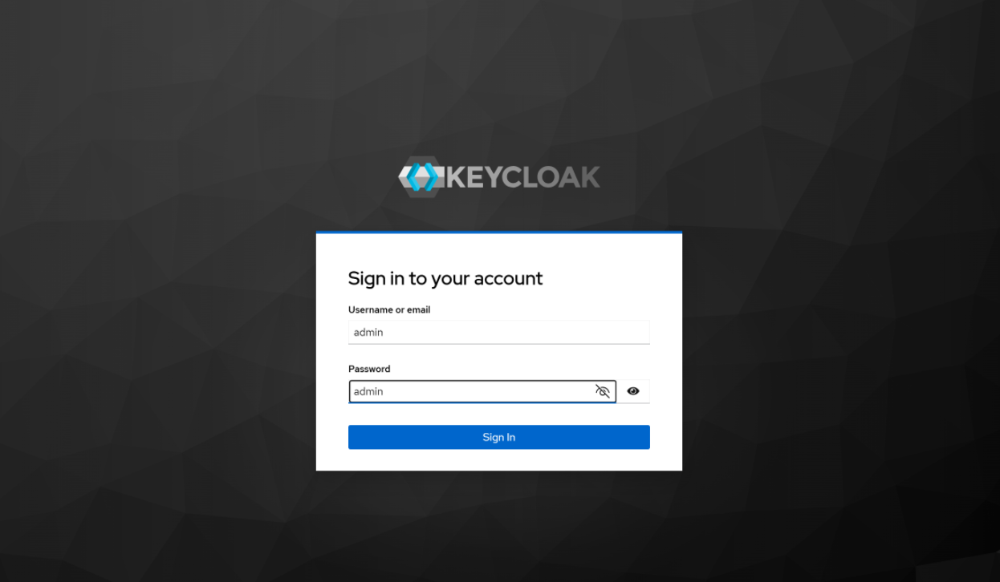
<br>
<br>

3. Set up the client<br>
Set the client ID
- Client ID: test_client
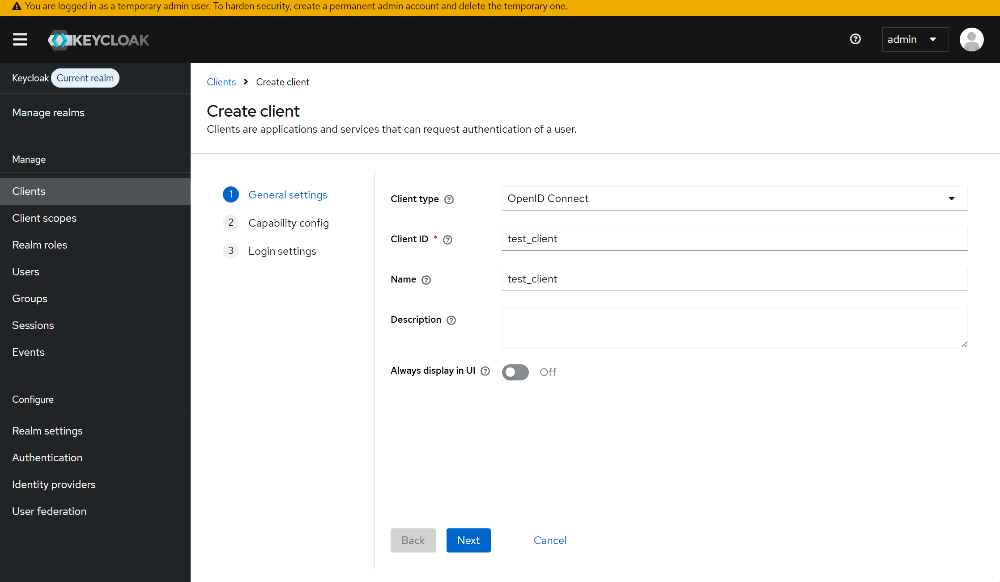
<br>
<br>

Apply settings according to the flow.
- Standard flow: When using authorization code flow API features, check this ☑
- Direct access grants: For using the Resource Owner Password Credentials Flow API features, check this ☑
- Service accounts roles: When using the client system authentication API, check this ☑ <br>
Note: Other flows are optional<br>
Note: If you want to create a custom realm or user, create them here
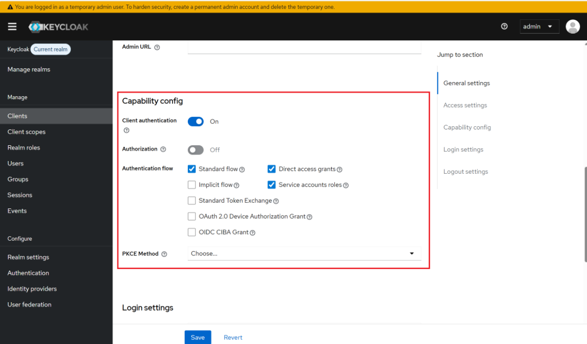
<br>
<br>

4. Copy the client secret
- Copy the client secret from the Credentials tab of the client created in step 3
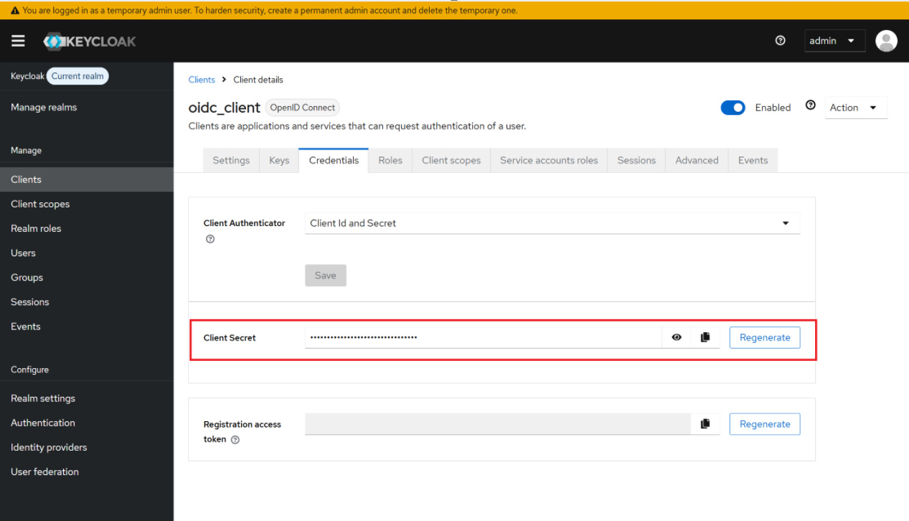

<br>

## Web API Transfer Module Communication Procedure
### ■When authorization is not required (Authorization by OpenFGA)
1. Route Registration & Confirmation

```
# Registration
curl -X POST\
    -H "Content-Type: application/json"\
    -H "X-API-KEY: your-secret-management-api-key"\
    -d '{
    "id": "route1",
    "uri": "http://prism:4010",
    "predicates": [{
        "name": "Path",
        "args": {
        "_genkey_0": "/test/**"
        }
    }]
    }'\
    http://localhost:8090/actuator/gateway/routes/route1

 # Confirmation
curl -s -H "X-API-KEY: your-secret-management-api-key"\
    http://localhost:8090/actuator/gateway/routes
```

<br>

2. Obtain Token (clientID: test_client)

```
curl -X POST http://keycloak:8081/realms/master/protocol/openid-connect/token \
  -H "Content-Type: application/x-www-form-urlencoded" \
  -H "accept: application/json" \
  -H "Accept-Language: ja-JP" \
  -d "grant_type=client_credentials" \
  -d "client_id=test_client" \
  -d "client_secret=<copied client secret>" 
```

<br>

3. Send Request to WebAPI Forwarding Module

```
curl -v -X POST http://localhost:8090/test \
  -H "Content-Type: application/json" \
  -H "Authorization: bearer <obtained token>" \
  -H "api-key: 12345-test-key" \
  -d '{"userid":112233}'
```
Note:Authentication using the client credentials flow.<br>


4. Response (/test endpoint)

```
Request successfully delivered!
```

### ■When authorization is required (Authorization by OpenFGA)
1. Authorization setup steps

1.1 In the Keycloak console, configure a fixed-value custom claim in the access token.<br>
After completing the **Keycloak Settings**, open the Clients list and click the client you created (`test_client`).

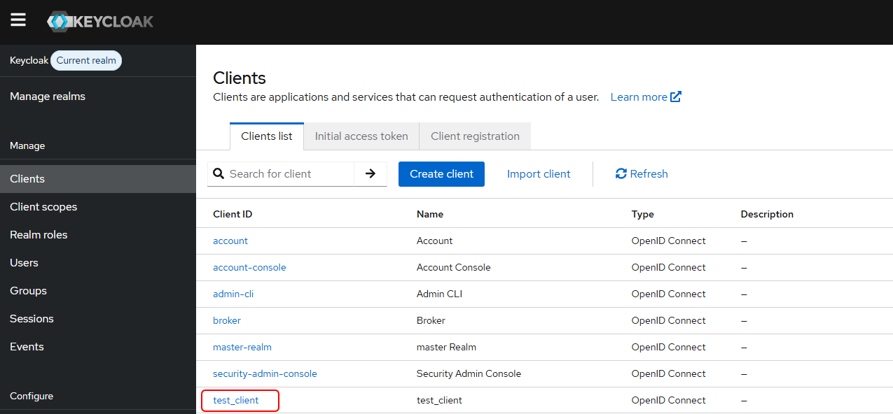
<br>
<br>

1.2 Select the `Client Scopes` tab and click the `test_client-dedicated` link.

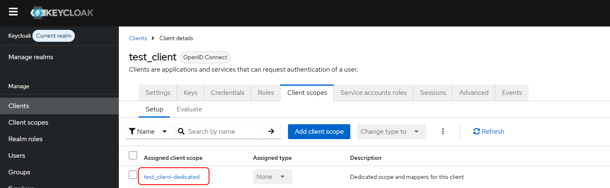
<br>
<br>

1.3 Click `Configure a new mapper`.

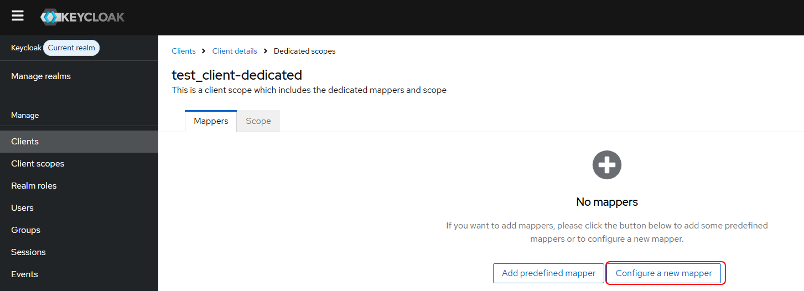
<br>
<br>

1.4 Choose `Hardcoded claim`.

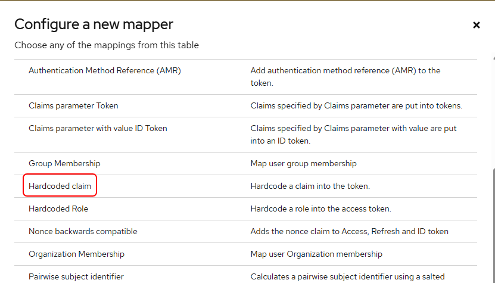
<br>
<br>

1.5 Enter each item in the settings screen below.<br>
Once you have finished entering your information, click the `SAVE` button
 - Example: Name: `operator_id`
 - Token Claim Name: `operator_id`
 - Claim value: `sample-user`

 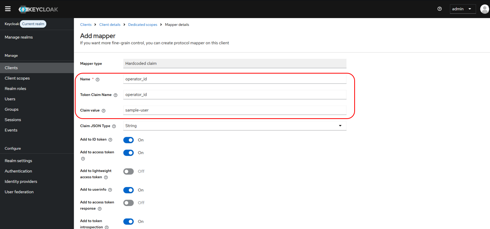
 <br>
 <br>

1.6 Open the OpenFGA playground at [http://localhost:3000/playground](http://localhost:3000/playground) and create a store.<br>

e.g. `test-store2`<br>
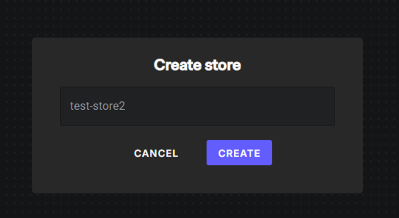
<br>
<br>

1.7 Create the model.<br>
Replace the model content with the following and click `SAVE`:

```
model
  schema 1.1

type user

type group
  relations
    define member: [user]

type endpoint
  relations
    define can_access: [user, group#member]
```

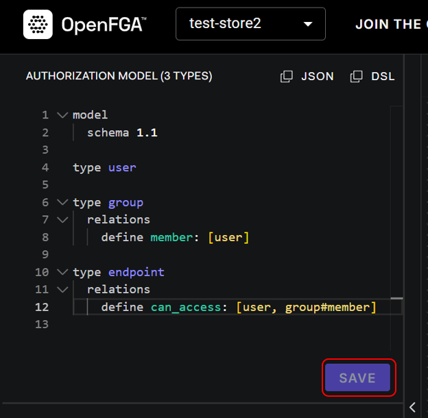
<br>
<br>

1.8 Add a Tuple.<br>
click `ADD TUPLE`.

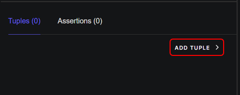
<br>
<br>

1.9 Enter the following values in each field of the tuple, then click the `SAVE` button.<br>
If the save is successful, the message `Success! Tuple created!` will appear.<br>
 Example: 
 - User: `user:sample-user`
 - Relation: `can_access`
 - Object: `endpoint:api.test`

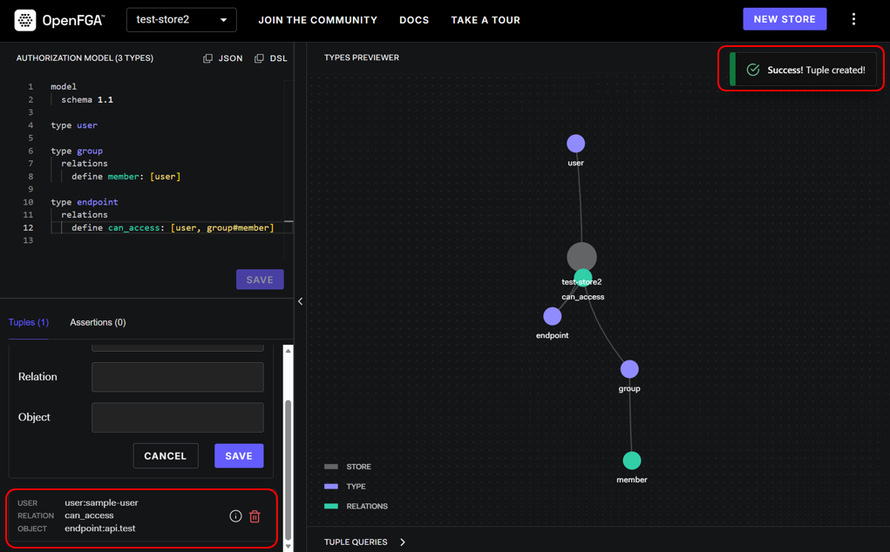
<br>
<br>

1.10 Copy the Store ID of the store you created.

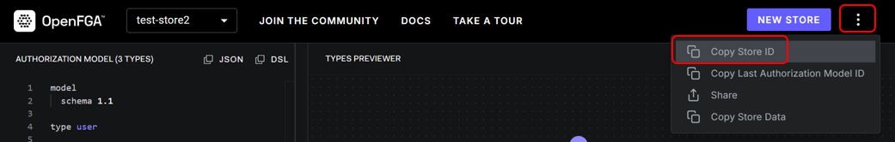
<br>
<br>

1.11 If the Web API forwarding module (L2) is running, stop it.<br>
Note: You must restart the Web API Transfer Module (L2) to change the Store ID.

```
docker compose down gateway
```

1.12 Edit `docker-compose.yml` and update the `gateway` service environment variables.
 - `FGA_STORE_ID` = the Store ID copied in step 1.10
 - `AUTHZEN_AUTHORIZATION_ENABLED` = `true`

```
# Open `docker-compose.yml` in edit mode
vi docker-compose.yml

# Changes
  gateway:
    image: l2-test:latest
    environment:
      - KEYCLOAK_URL=http://keycloak:8081
      - KEYCLOAK_REALM=master
      - FGA_URL=http://openfga:8080
      - FGA_STORE_ID=test-store ← the Store ID copied in step 1.10
      - DB_URL=jdbc:postgresql://postgres:5432/postgres
      - DB_USERNAME=postgres
      - DB_PASSWORD=password
      - DB_SCHEMA=public
      - VALID_API_KEYS=12345-test-key
      - LOGLEVEL=DEBUG
      - VALID_API_KEYS_ENABLED=true
      - AUTHZEN_AUTHORIZATION_ENABLED=false ← set to `true` when using OpenFGA
```

1.13 Restart the Web API forwarding module (gateway)

```
docker compose up -d gateway
```

2. Route Registration & Confirmation

```
# Registration (add metadata block)
curl -X POST \
  -H "Content-Type: application/json" \
  -H "X-API-KEY: your-secret-management-api-key" \
  -d '{
    "id": "route02",
    "uri": "http://prism:4010",
    "predicates": [{ 
        "name": "Path",   
        "args": { 
        "_genkey_0": "/authtest/**"
         }
    },
      { 
        "name": "Method",
        "args": { 
        "_genkey_0": "POST"
        }
    }],
    "metadata": {
      "endpointId": "api.test"
    }
  }' \
  http://localhost:8090/actuator/gateway/routes/route02

 # Registering the root for authorization errors
curl -X POST \
  -H "Content-Type: application/json" \
  -H "X-API-KEY: your-secret-management-api-key" \
  -d '{
    "id": "route03",
    "uri": "http://prism:4010",
    "predicates": [{ 
        "name": "Path",   
        "args": { 
        "_genkey_0": "/authngtest/**"
         }
    },
      { 
        "name": "Method",
        "args": { 
        "_genkey_0": "POST"
        }
    }],
    "metadata": {
      "endpointId": "api.ng.test"
    }
  }' \
  http://localhost:8090/actuator/gateway/routes/route03
  
 # Confirmation
curl -s -H "X-API-KEY: your-secret-management-api-key"\
     http://localhost:8090/actuator/gateway/routes | jq
```

3. Obtain Token (clientID: test_client)

```
curl -X POST http://keycloak:8081/realms/master/protocol/openid-connect/token \
  -H "Content-Type: application/x-www-form-urlencoded" \
  -H "accept: application/json" \
  -H "Accept-Language: ja-JP" \
  -d "grant_type=client_credentials" \
  -d "client_id=test_client" \
  -d "client_secret=<copied client secret>" 
```
Note:Authentication using the client credentials flow.


4. Send Request to the Web API forwarding module

```
 # Normal
curl -v -X POST http://localhost:8090/authtest \
  -H "Content-Type: application/json" \
  -H "Authorization: bearer <obtained token>" \
  -H "api-key: 12345-test-key" \
  -d '{"userid":112233}'
  
 # Authorization error
curl -v -X POST http://localhost:8090/authngtest \
  -H "Content-Type: application/json" \
  -H "Authorization: bearer <obtained token>" \
  -H "api-key: 12345-test-key" \
  -d '{"userid":112233}'
```

5. Response

```
# Normal(/authtest endpoint)
Request successfully delivered!

# Authorization error(/authngtest endpoint)
  {
    "code": "[auth] Forbidden",
    "message": "Access denied",
    "detail": "timeStamp: 2025-09-25T14:30:00Z" // This value varies depending on the date and time of execution.
  }
```

## Documentation
- For explanations of each command executed in the tutorial, see [here](./command_en.md)
- For specifications of the Web API forwarding module, refer to [here](./Web-API-Transfer-Module-API-Gateway-Specification_en.md)